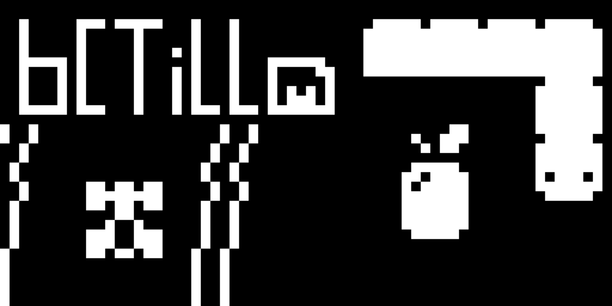

# 🕹️ CHIP-8 BetilloEmulator

Un emulador funcional de la arquitectura CHIP-8 desarrollado en **Rust**, capaz de ejecutar ROMs clásicas y programas personalizados.



### Características
* **Ciclo de CPU completo:** Implementación de *Fetch, Decode y Execute*.
* **Gráficos:** Renderizado mediante la librería `minifb` con escalado de píxeles.
* **Memoria:** Gestión de 4096 bytes de RAM y stack de 16 niveles.
* **Fuentes personalizadas:** Carga de un set de fuentes hexadecimales en la memoria base.

### Arquitectura del Proyecto
El emulador está dividido en módulos para mantener una separación de responsabilidades clara:

1.  **`chip8.rs`**: Define el "Estado" de la máquina (Registros, Memoria, Pantalla).
2.  **`cpu.rs`**: Contiene el motor lógico (Opcodes y ciclo de instrucciones).
3.  **`main.rs`**: Maneja el loop de renderizado, la carga de la ROM y la interacción con el usuario.

---

## 🧠 Desafíos Técnicos y Aprendizaje

### 1. ¿Cómo manejé el "Endiness" y la unión de bytes?

- CHIP-8 usa *Big-endian*. Tuve que combinar dos bytes de la memoria para formar una sola instrucción (opcode) de 16 bits, desplazando el primero a la izquierda.

### 2. ¿Cuál fue el reto del Opcode de dibujo (0xDXYN)?

- Este es el opcode más complejo. Implementé la lógica de **XOR** para los píxeles (que es como CHIP-8 detecta colisiones) y el uso del registro `VF` como bandera de colisión si un píxel se apaga. Además, manejé el "wrapping" para que el dibujo no rompa la memoria si sale de las coordenadas.

### 3. ¿Cómo controlé la velocidad de ejecución?

- Si la CPU corre a la velocidad de mi procesador moderno, el juego termina en un milisegundo. Implementé un límite de 60Hz para los timers y ejecuté 8 instrucciones por frame para balancear la velocidad del juego.

---

## 🎨 Mi Propia ROM: "BETILLO.ch8"
Como prueba de concepto final, no solo corrí juegos existentes, sino que **diseñé mi propio logo en lenguaje de máquina**.
* **Proceso:** Dibujé los bytes en binario para formar las letras, los cargué en una ROM y utilicé el registro `I` y el opcode de dibujo para proyectarlo en pantalla.

---

## 🛠️ Estado de Implementación de Opcodes (Set Estándar)

A continuación se detalla el progreso de las 35 instrucciones estándar de CHIP-8 según la referencia técnica de Cowgod:

| Opcode | Instrucción | Descripción | Estado |
| :--- | :--- | :--- | :---: |
| `00E0` | **CLS** | Limpia la pantalla | ✅ |
| `00EE` | **RET** | Retorna de una subrutina | ✅ |
| `1NNN` | **JP addr** | Salto a la dirección `NNN` | ✅ |
| `2NNN` | **CALL addr** | Llama a una subrutina en `NNN` | ✅ |
| `3XKK` | **SE Vx, byte** | Salta si `VX == KK` | ✅ |
| `4XKK` | **SNE Vx, byte** | Salta si `VX != KK` | ✅ |
| `5XY0` | **SE Vx, Vy** | Salta si `VX == VY` | ✅ |
| `6XKK` | **LD Vx, byte** | Establece `VX = KK` | ✅ |
| `7XKK` | **ADD Vx, byte** | Establece `VX = VX + KK` | ✅ |
| `8XY0` | **LD Vx, Vy** | Establece `VX = VY` | *Pendiente* |
| `8XY1` | **OR Vx, Vy** | bitwise `VX OR VY` | *Pendiente* |
| `8XY2` | **AND Vx, Vy** | bitwise `VX AND VY` | *Pendiente* |
| `8XY3` | **XOR Vx, Vy** | bitwise `VX XOR VY` | *Pendiente* |
| `8XY4` | **ADD Vx, Vy** | `VX + VY`, `VF = carry` | *Pendiente* |
| `8XY5` | **SUB Vx, Vy** | `VX - VY`, `VF = NOT borrow` | *Pendiente* |
| `8XY6` | **SHR Vx** | Desplazamiento a la derecha | *Pendiente* |
| `8XY7` | **SUBN Vx, Vy** | `VY - VX`, `VF = NOT borrow` | *Pendiente* |
| `8XYE` | **SHL Vx** | Desplazamiento a la izquierda | *Pendiente* |
| `9XY0` | **SNE Vx, Vy** | Salta si `VX != VY` | *Pendiente* |
| `ANNN` | **LD I, addr** | Establece `I = NNN` | ✅ |
| `BNNN` | **JP V0, addr** | Salto a `NNN + V0` | *Pendiente* |
| `CXKK` | **RND Vx, byte** | `VX = random AND KK` | *Pendiente* |
| `DXYN` | **DRW Vx, Vy, n** | Dibuja sprite en pantalla | ✅ |
| `EX9E` | **SKP Vx** | Salta si tecla en `VX` está pulsada | *Pendiente* |
| `EXA1` | **SKNP Vx** | Salta si tecla en `VX` NO está pulsada | *Pendiente* |
| `FX07` | **LD Vx, DT** | Lee Delay Timer | *Pendiente* |
| `FX0A` | **LD Vx, K** | Espera pulsación de tecla | *Pendiente* |
| `FX15` | **LD DT, Vx** | Establece Delay Timer | *Pendiente* |
| `FX18` | **LD ST, Vx** | Establece Sound Timer | *Pendiente* |
| `FX1E` | **ADD I, Vx** | `I = I + VX` | ✅ |
| `FX29` | **LD F, Vx** | `I =` ubicación fuente para `VX` | *Pendiente* |
| `FX33` | **LD B, Vx** | Almacena BCD de `VX` en `I, I+1, I+2` | *Pendiente* |
| `FX55` | **LD [I], Vx** | Guarda `V0..VX` en memoria | *Pendiente* |
| `FX65` | **LD Vx, [I]** | Carga `V0..VX` desde memoria | *Pendiente* |

---

## 🛠️ Instalación y Uso

### Opción A: Descargar el Binario (Recomendado)
Si solo quieres probarlo, ve a la sección de [Releases](https://github.com/betilloXann/chip-8/releases) y descarga el archivo `.zip` para tu sistema operativo.

1. Descomprime el archivo.
2. Asegúrate de tener la ROM en la ruta `src/roms/BETILLO.ch8`.
3. Ejecuta el binario:
   ```bash
   ./chip-8

### Opción B: Compilar desde el Código Fuente
Requiere tener instalado Rust/Cargo

1. Clona el repositorio:

```bash
git clone https://github.com/betilloXann/chip-8.git
cd chip-8
```

2. Compila en modo optimizado (Release):
`cargo build --release`

3. Ejecuta el emulador:
`./target/release/chip-8`

*Desarrollado con 🦀 por betilloXann*
